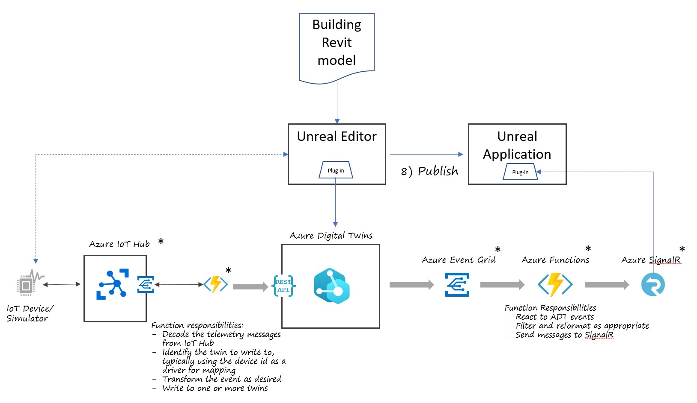

# Epic Unreal Engine and Azure Digital Twins integration demo

TODO:  hyperlinks, etc

The purpose of this sample is to demonstrate how to integrate [Azure Digital Twins (ADT)] with the [Epic Unreal Engine] via the [Unreal ADT Plug-in]. This sample shows you the "backstage" of the downloadable and playable demo hosted [here]. If you just want to see a playable sample of the integration, feel free to walk through that demo. If you want to know how it works, read on.

In this sample, you will walk through the process of:

* importing a building model into the Unreal Engine,
* use the Unreal ADT plug-in to model sensors of various types in the building
* push those sensors and their hierarchy in the building to an ADT model and twin graph
* hook up simulated versions of those sensors to the Azure IoT Hub and use that data to update the twins with the latest readings
* tour the building virtually and see the sensor data changing in real time

A high level architecture of the sample is shown below

## Prerequsites

To start the process of deploying the demo, you must first work through a few pre-requisites.

### Unreal prerequisites

### Azure Resources and simulated IoT devices

* To deploy the Azure resources, you must have an active Azure subscription in which you have owner permissions. If you do not have an Azure subscription, you can sign up for a free account [here](https://azure.microsoft.com/en-us/free/)
* [Azure Cloud Shell](https://docs.microsoft.com/en-us/azure/cloud-shell/quickstart) -- just create the bash cloud shell, stop before you create the resource group
* [NodeJS](https://nodejs.org/en/download/) - you need NodeJS on your local development machine to run the IoT device simulator we will use

With the pre-requisites installed, you are ready to begin work on the demo

## Unreal stuff goes here

TODO:  

## Deploy Azure Infrastructure

As the focus of this demo is primarily on the integration, we've automated most of the setup of the Azure components of the solution. If you want to understand better the components involved on the Azure side, you can walk through the hands-on labs and mslearn modules.

At a high level, the key Azure components are:

* [Azure IoT Hub] - this is the primary connection point for IoT devices in the Azure cloud. It ingests the telemetry data from our (simulated) IoT sensors.
* [Azure Digital Twins] - this is the primary Azure service being demonstrated in this sample. ADT allows you to model the 'real world' and add critical business context, hierarchy, and enriched information to the raw telemetry data ingested from IoT Hub
* [Azure SignalR Service] - SignalR is a high scale, high performance pub-sub service hosted in Azure. It allows a sender to submit messages in real time to a large number of simultaneous listening applications. In the sample here, we will only have one listener, but for the playable sample demo, we may have many listening
* [Event Grid] and [Azure Functions] - these components act as the routing and glue between the major components. EventGrid routes messages to the functions in response to events (telemetry received or twin data updated) and the functions perform message transformation and updating.

To deploy the backend Azure services involved, follow the instructions [here](docs/deploy-azure-resources.md). Note that there are a number of pieces of information you need to save from this process for later use.

## Configure Unreal connections to Azure

TODO:  

## Simulate Devices

The next step is to simulate device data from our building IoT sensors. To set up the simulated devices, follow the instructions [here](docs/simulate-iot-devices.md)

> NOTE:  the instructions referenced above describe an interactive simulation of devices run from your desktop, which we recommend running first. However, if you want or need to have the device simulation running all the time, follow the alternate instructions [here](/devices/kubernetes/dev-sim-aks.md) to run the mock-devices in a docker container in [Azure Kubernetes Service]

## View results in the Unreal Engine
