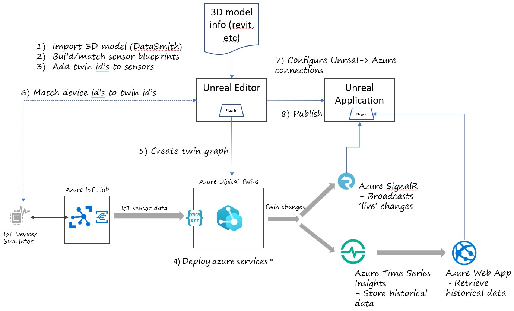

# Unreal Engine and Azure Digital Twins integration demo

 The ADT Link plugin and this sample content was developed by WSP in collaboration with Microsoft and Epic Games in order to demonstrate how to integrate [Azure Digital Twins (ADT)](https://docs.microsoft.com/en-us/azure/digital-twins/overview) with the [Unreal Engine](https://www.unrealengine.com/). This sample shows you the "backstage" of the downloadable and playable demo hosted [here]. If you just want to see a playable sample of the integration, feel free to walk through that demo. If you want to know how it works and recreate it, read on.

In this sample, you will:

* establish a building model in Unreal Engine,
* use the ADT Link plugin to model sensors of various types in the building
* push those sensors and their hierarchy in the building to an ADT model and twin graph
* hook up simulated versions of those sensors to the Azure IoT Hub and use that data to update the twins with the latest readings
* tour the building virtually and see the sensor data changing in real time

A high level architecture of the sample is shown below.

### What It Does

This documentation will get you set up with an example scene of a WSP office building digital twin, with pre-determined sensors and settings.

### What It Does Not Do

This documentation will not show you how to configure bespoke sensors and settings for your own digital twin. The backbone is there, but this workflow is not polished yet. If attempting this, support may be limited.

## Prerequisites

To start the process of deploying the demo, you must first work through a few pre-requisites.

### Azure Resources and simulated IoT devices

* To deploy the Azure resources, you must have an active Azure subscription in which you have owner permissions. If you do not have an Azure subscription, you can sign up for a free account [here](https://azure.microsoft.com/en-us/free/)
* A [PowerShell Azure Cloud Shell](https://docs.microsoft.com/en-us/azure/cloud-shell/quickstart-powershell)
* [NodeJS](https://nodejs.org/en/download/) - you need NodeJS on your local development machine to run the IoT device simulator

### Unreal Engine Prerequisites

* The ADT Link plugin and its sample content are designed for UE 4.26.

With the pre-requisites installed, you are ready to begin work on the demo

## Deploy Azure Infrastructure

As the focus of this demo is primarily on the integration, we've automated most of the setup of the Azure components of the solution. If you want to better understand the components involved on the Azure side, you can walk through the hands-on labs and MS Learn modules.

At a high level, the key Azure components are:

* [Azure IoT Hub](https://azure.microsoft.com/en-us/services/iot-hub/) - this is the primary connection point for IoT devices in the Azure cloud. It ingests the telemetry data from our (simulated) IoT sensors.
* [Azure Digital Twins](https://azure.microsoft.com/en-us/services/digital-twins/) - this is the primary Azure service being demonstrated in this sample. ADT allows you to model the 'real world' and add critical business context, hierarchy, and enriched information to the raw telemetry data ingested from IoT Hub
* [Azure SignalR Service](https://azure.microsoft.com/en-us/services/signalr-service/) - SignalR is a high scale, high performance pub-sub service hosted in Azure. It allows a sender to submit messages in real time to a large number of simultaneous listening applications. In the sample here, we will only have one listener, but for the playable sample demo, we may have many listening
* [Azure Time Series Insights](https://azure.microsoft.com/en-us/services/time-series-insights/) - Time Series Insights is a time-series store, query, and dashboarding service. For this solution, we leverage is as the store and rendering mechanism for the historical data graphs for the sensors
* [Event Grid](https://azure.microsoft.com/en-us/services/event-grid/) and [Azure Functions](https://docs.microsoft.com/en-us/azure/azure-functions/functions-overview) - these components act as the routing and glue between the major components. Event Grid routes messages to the functions in response to events (telemetry received or twin data updated) and the functions perform message transformation and updating.

To deploy the backend Azure services involved, follow the instructions [here](docs/deploy-azure-resources.md). Note that there is a configuration file that will be generated during this process that you will need to download and keep for the next step.

## Configure Unreal Connections to Azure

Following [these instructions](docs/adt-link-plugin-ue.md) will get you set up with the ADT Link plugin for Unreal Engine and walks you through steps required for establishing a connection to ADT and creating virtual sensors in the example scene.

## Simulate Devices

The next step is to simulate device data from our building IoT sensors. To set up the simulated devices, follow the instructions [here](docs/simulate-iot-devices.md).

## View results in the Unreal Engine

After following the three guides above, you should end up with a playable office scene that visualizes live data coming from your own Azure Digital Twin.
