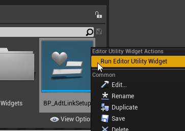
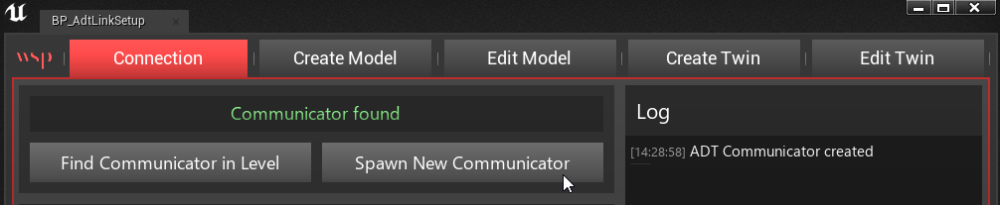
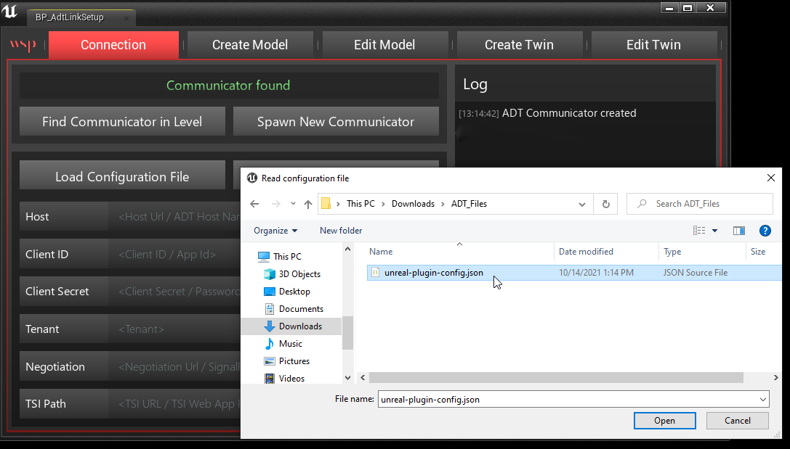
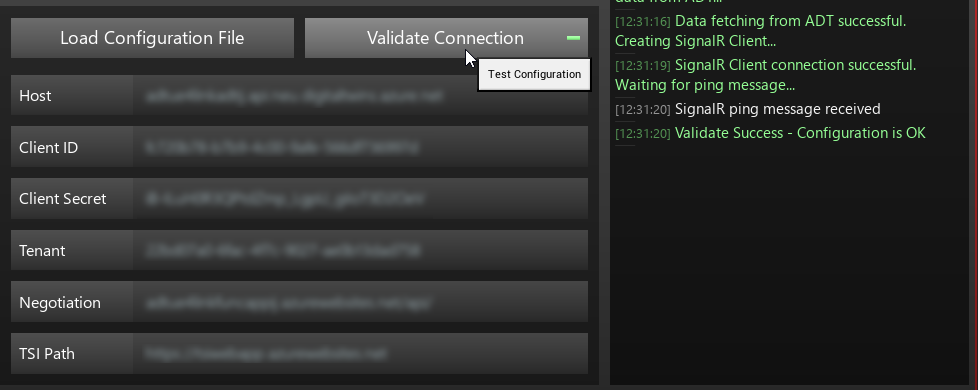
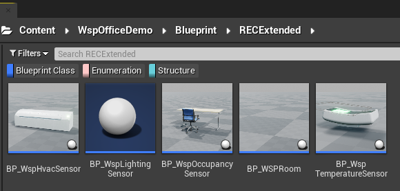
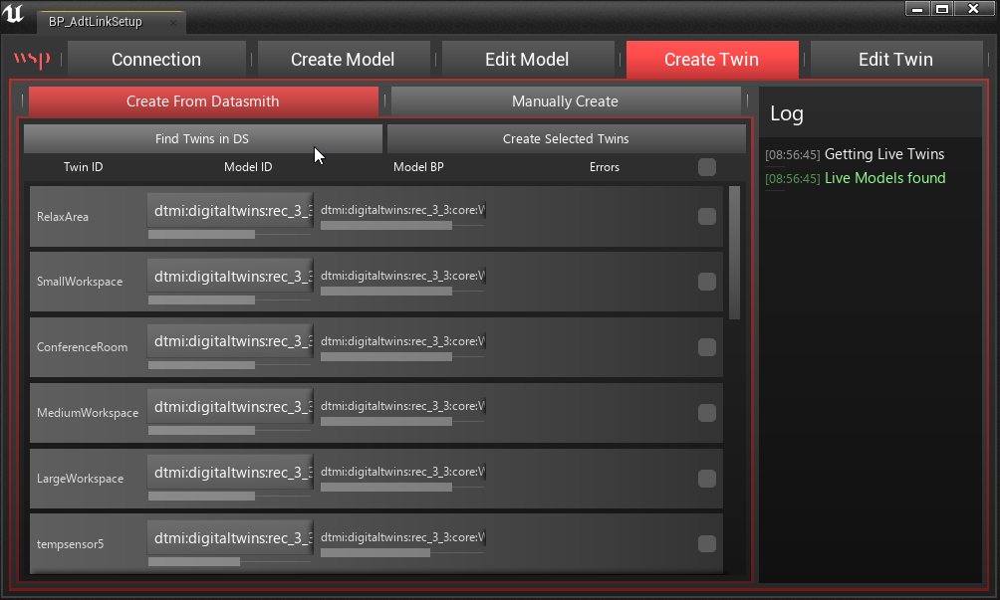
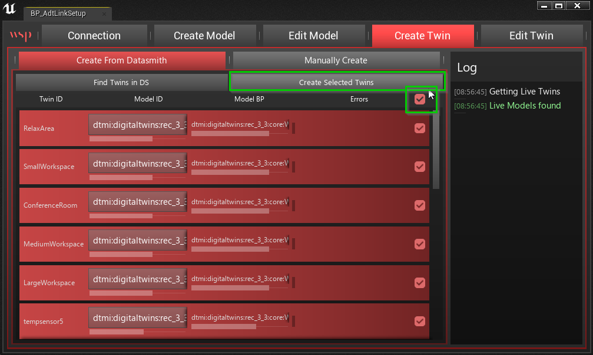
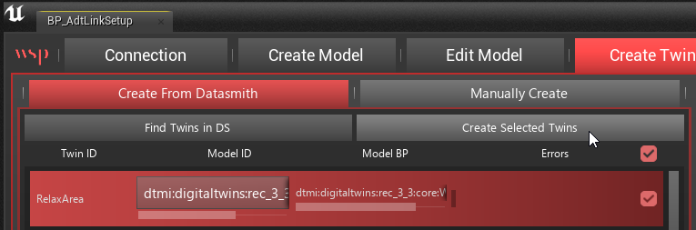
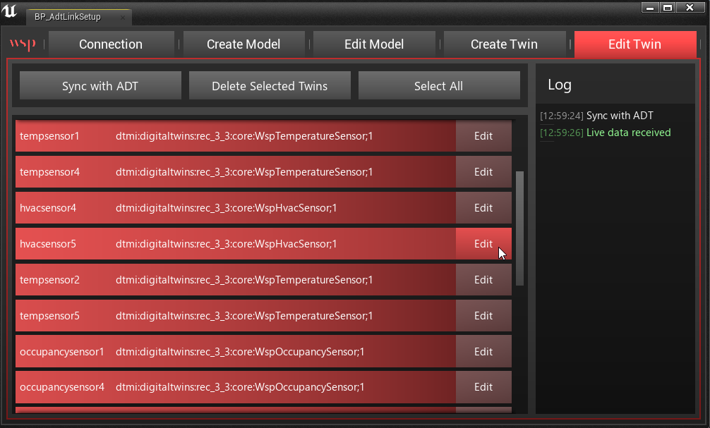
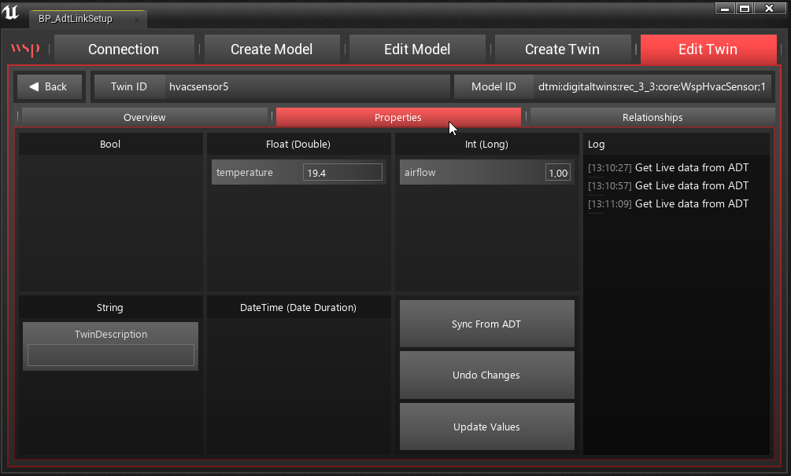

# ADT Link Plugin
**Unreal Engine Plugin Documentation**

## Introduction

Digital Twins is the technological trend where virtual representations of real-world objects are driven and informed by live data. It could be a 3D skyscraper showing the occupancy and temperature of each room, or a bird’s eye view of a city overlaid with traffic visualization and realistic weather effects.

Unreal Engine has become a leading technology for building interactive and realistic 3D models across every industry and we built the ADT Link plugin in order to make it easier for developers to build and research Digital Twins using Microsoft’s [Azure Digital Twins](https://azure.microsoft.com/en-us/services/digital-twins/) (ADT) platform. ADT is a highly scalable solution for managing IOT devices and integrating them into a larger system of analytics and insights.

#### Prerequisites

1. This process assumes you already set up your ADT infrastructure following [this guide](https://github.com/stevebus/unrealdemo).
2. This plugin and sample are designed for UE 4.26 and newer.

## The Sample Project

To showcase the general workflow and capabilities, we built an example Unreal Engine project that you can dig into and explore. The sample contains the following components:

1. The ADT Link plugin
2. A high resolution point cloud of the WSP office
3. A Datasmith and Revit model of the WSP office
4. A live connection to our active ADT instance
5. Examples of custom device models

## Setting Up Your First Digital Twin

Open the “DigitalTwinProject” Unreal Engine project. In the Plugins window (Edit > Plugins) make sure that “AdtLink” and “Datasmith Importer” plugins are enabled.

Create a new level in the project however you like. Going to File > New Level > TimeOfDay will give the best visuals for the next steps.

Using the Datasmith button from the toolbar, import the provided WSP_Office.udatasmith file into the current level using default settings. It should like this:

### Connecting to Azure Digital Twin

Accessing live data and devices from ADT is all handled through the AdtLink plugin, but the initial connection and sensor setup must be done by you. Luckily we provide a utility with the plugin that will help you do this. 

First, you need to make sure you have Show Plugin Content enabled in your Content Browser. If the AdtLink plugin is enabled, you should see a “AdtLink Content” folder in your list of sources. If you don’t see this list, click on the Sources icon next to Filters.

You’ll find a Blueprint utility called “BP_AdtSetup” in the AdtLink Content/AdtLink/Utilities folder. Right click on this widget blueprint and select Run Editor Utility Widget. A user interface window will appear on top of the editor.

The flow of this interface goes like this:

1. Connection - Establishing the communicator Blueprint
2. Create Model - Uploading our sensor types to ADT
3. Create Twin - Create our virtual sensors in UE and connect them to the ADT twins

### Connection

To start, you will choose “Spawn New Communicator” in the Connection menu. This adds a Blueprint actor of type “BP_ADTCommunicator” into your scene and you should see a “Communicator found” message if it succeeded. If you’re working in a level that already has this blueprint, just click “Find Communicator in Level” instead.

To establish a connection to a live instance of Azure Digital Twins via the Communicator, there are several parameters required. These parameters can be typed in manually, but the easiest method is to “Load Configuration File” and use the “unreal-plugin-config.json” file you created in the [initial ADT setup.](https://github.com/stevebus/unrealdemo/blob/main/docs/deploy-azure-resources.md#download-config-files) Once you click on “Validate Connection”, it should light up green and print successful results to the log if the configuration is correct and your ADT instance is operational.

### Create Models

Azure Digital Twins uses the concept of “models” to represent the entities that you need to replicate from the physical world to the digital. A model can be used to define a device or sensor, but can also be used to define broader concepts such as a room, a floor, a building, or a capability _within_ another model. Any data we want to get from our digital twin must first be defined inside Unreal Engine as a Blueprint, and then uploaded to ADT. 

For the purposes of this sample we have already created Model Blueprints that correspond with the sample devices provided in the ADT setup. Creation your own custom models and devices will be covered in another guide.

In the AdtLink plugin we’ve predefined 8 models using the [Real Estate Core ontology](https://github.com/Azure/opendigitaltwins-building), which is a good starting place for typical AECO models:

*   Building
*   Level
*   Room
*   Space
*   Capability
*   Sensor
*   Temperature Sensor
*   Air Temperature Sensor

These are found in various folders under AdtLinkContent/AdtLink/ModelBP/REC

Some of these models “extend” others. For example, the Temperature Sensor model is an extension of the base model Sensor. And Sensor has a variety of Capabilities within it. This is important to understand in the next step because you cannot upload and create a model if the model it extends isn’t already there.

Inside the plugin content we’ve also extended Sensor, Capability, and Space to create 5 custom WSP models::

*   WSP Room
*   WSP HVAC Sensor
*   WSP Lighting Sensor
*   WSP Occupancy Sensor
*   WSP Temperature Sensor

These can be found in folders under AdtLinkContent/WspOfficeDemo/Blueprint/RECExtended

### Uploading the Models

In the “Create Model” menu, you can see the three steps to the left:

1. Select Model BP in Content Browser
2. Press “Convert to JSON”
3. Press “Upload to ADT”

Upload your first model by navigating to AdtLink Content/AdtLink/ModelBP/REC and selecting “BP_Space.” Then click “Convert to JSON”, which should populate the text box with the converted JSON data contained in the Blueprint. Press “Upload to ADT” to send it to the ADT instance. Watch the Log to make sure there aren’t any errors.

Assuming the first model works, proceed to convert and upload the other models in this exact order:

From /AdtLink/ModelBP/**REC:**

1. BP_Space (_done)_
2. BP_Capability
3. BP_Sensor

From /AdtLink/WspOfficeDemo/Blueprint/**RECExtended:**

4. BP_WspHvacSensor
5. BP_WspLightingSensor
6. BP_WspOccupancySensor
7. BP_WspTemperatureSensor

After you’ve finished uploading the models, you can head to the “Edit Mode” menu to synchronize with ADT and see what models are living up there. You can “Edit” each model, but for any substantial changes you should delete it and upload a new version.

### Create Twin

The “models” that now reside on ADT define what type of entities and sensors exist in your digital twin, and the “twins” that we will now create are the specific instances of each entity that we will be reflecting between UE and ADT.

There are two ways to create twins:

1. Detecting twins from a Datasmith import
2. Manually defining a twin

For this example project we will only be focusing on the first option. The Datasmith model we previously imported contained a few meshes with ADT-specific metadata for “ModelID” and “TwinID”. 

In the Create Twin window, there is a button for “Find Twins in DS”. Clicking on this will detect any twins present in our scene and should populate the list with the various Twin IDs and their Model IDs as defined in the original Revit file. The utility also associates them with the appropriate ModelBP’s we uploaded earlier. You can change the Model ID to a different type if there’s ever an error.

Now that they are detected and valid, we will create new Blueprint Actors in our scene for each one. Click the “Select” button to highlight all the Twins You can also select or deselect by clicking on the Model BP column.

Then press “Create Selected Twins” below.

The Log will populate with the various twins being spawned and synchronized in both UE and ADT. In your World Outliner you should now notice that there are various Blueprint actors such as “lightingsensor2” and “occupancysensor1” attached to their respective 3D meshes. Each of these have an ADT Twin Component that brokers the connection to ADT via the Communicator we set up earlier.

Now whenever you press Play or Simulate, the various sensors in the scene will be driven by their twins living on ADT. You should see relevant visual elements changing as the data comes in and changes.

If these twins need editing for any reason, there is an “Edit Twin” window back in the utility. Here you can click the “Edit” button next to any active twin and see or modify its properties.

