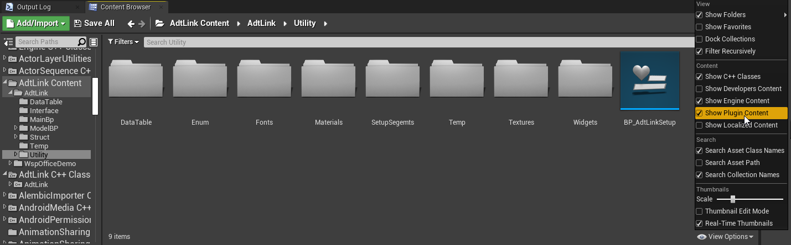
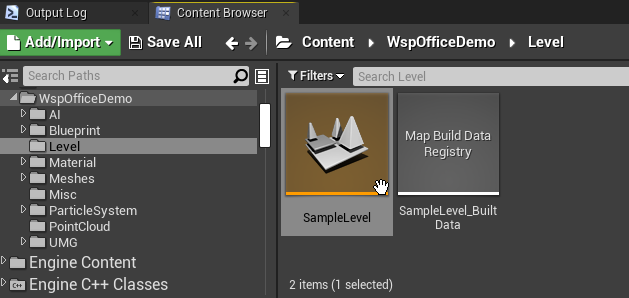
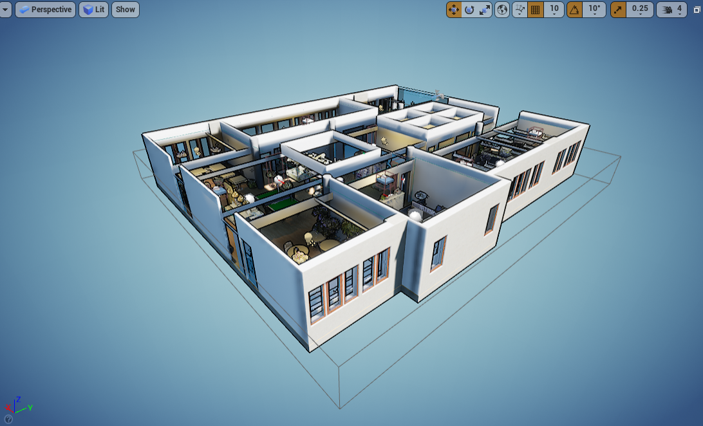
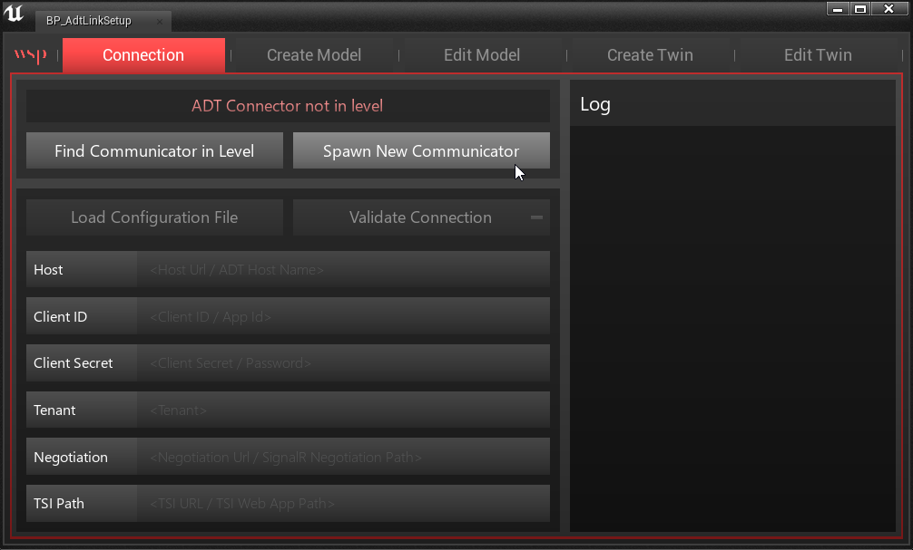
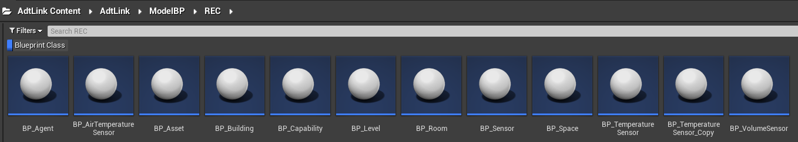
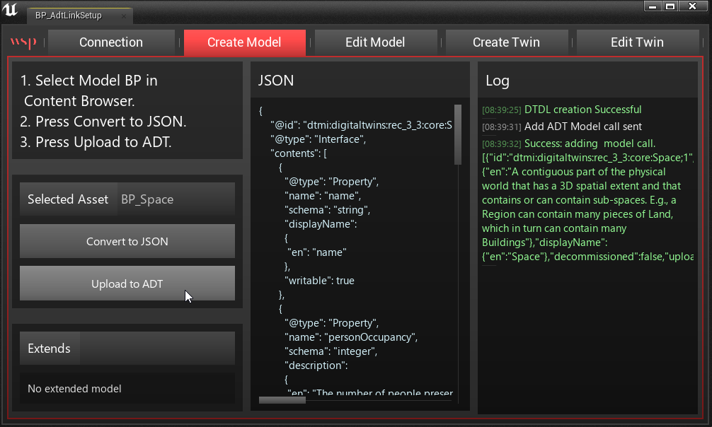

# ADT Link Plugin

This guide walks you through the installation and setup of the ADT Link plugin for Unreal Engine. By the end of this document you will have a sample scene of the WSP office building connected to an Azure Digital Twins instance. Virtual sensors will exist in both environments and will stay in sync once the sensor data is activated in a later stage.

## Installing the Plugin

This GitHub repository hosts the files and documentation required to deploy an Azure Digital Twins solution, but the Unreal Engine plugin is hosted externally. You will first need to [download the zip file] titled "AdtLink_plugin" (https://epicgames.box.com/s/x1nx6o45tsghoh3shj9zg4jjg5wzq2gk) and unzip it somewhere convenient.

## What's Included

To showcase the general workflow and capabilities, this Unreal Engine plugin contains the following components that you can dig into and explore:

1. The ADT Link plugin
2. A high resolution point cloud of the WSP office
3. A Datasmith and Revit model of the WSP office, for reference
4. An example level with a live connection to our active ADT instance
5. Examples of custom device models

## Setting Up Your First Digital Twin

 To use the ADT Link plugin, you'll need to create a new Unreal Engine project or use an existing one (4.26). We recommend starting a project from the "Architecure, Engineering, and Construction" category. Make sure your project is closed before proceeding. You need to add the ADT Link plugin to your chosen project by copying the "AdtLink" folder you unzipped and placing it into the "Plugins" folder of your Unreal Engine project. If no Plugins folder exists, create one.

 Open your project, and when it's open, enable the ADT Link plugin by going to Edit > Plugins and searching for it. Also verify that the Datasmith plugin and LiDAR Point Cloud plugin are enabled. This may require a restart for your project.

We provide a sample level in the plugin content that already has a Datasmith scene that correlates with the sensors being set up in this guide. To access it, you need to make sure you have Show Plugin Content enabled in your Content Browser. If the AdtLink plugin is enabled, you should see a “AdtLink Content” folder in your list of sources. If you don’t see this list, click on the Sources icon next to Filters.

It's called "StartupLevel" and is located in AdtLink Content/WspOfficeDemo/Level. Double-click to open it.

### Connecting to Azure Digital Twin

Accessing live data and devices from ADT is all handled through the AdtLink plugin, but the initial connection and sensor setup must be done by you. Luckily we provide a utility with the plugin that will help you do this.

You’ll find a Blueprint utility called “BP_AdtSetup” in the AdtLink Content/AdtLink/Utilities folder. Right click on this widget blueprint and select Run Editor Utility Widget. A user interface window will appear on top of the editor.

The flow of this interface goes like this:

1. Connection - Establishing the communicator Blueprint
2. Create Model - Uploading our sensor types to ADT
3. Create Twin - Create our virtual sensors in UE and register their twins in ADT

### Connection

To start, you will choose “Spawn New Communicator” in the Connection menu. This adds a Blueprint actor of type “BP_ADTCommunicator” into your scene and you should see a “Communicator found” message if it succeeded. If you’re working in a level that already has this blueprint, just click “Find Communicator in Level” instead.

To establish a connection to a live instance of Azure Digital Twins via the Communicator, there are several parameters required. These parameters can be typed in manually, but the easiest method is to “Load Configuration File” and use the “unreal-plugin-config.json” file you created in the [initial ADT setup.](./deploy-azure-resources.md#download-config-files) Once you click on “Validate Connection”, it should light up green and print successful results to the log if the configuration is correct and your ADT instance is operational.

### Create Models

Azure Digital Twins uses the concept of “models” to represent the entities that you need to replicate from the physical world to the digital. A model can be used to define a device or sensor, but can also be used to define broader concepts such as a room, a floor, a building, or a capability _within_ another model. Any data we want to get from our digital twin must first be defined inside Unreal Engine as a Blueprint, and then uploaded to ADT.

For the purposes of this sample we have already created Model Blueprints that correspond with the sample devices provided. Creation your own custom models and devices will be covered in another guide.

In the AdtLink plugin we’ve predefined 8 models using the [Real Estate Core ontology](https://github.com/Azure/opendigitaltwins-building), which is a good starting place for typical AECO models:

* Building
* Level
* Room
* Space
* Capability
* Sensor
* Temperature Sensor
* Air Temperature Sensor

These are found in various sub-folders under AdtLinkContent/AdtLink/ModelBP/REC.
In this image, we are using a filter for "Blueprint Class" to only show the Blueprint assets.

Some of these models “extend” others. For example, the Temperature Sensor model is an extension of the base model Sensor. And Sensor has a variety of Capabilities within it. This is important to understand in the next step because you cannot upload and create a model if the model it extends isn’t already there.

Inside the plugin content we’ve also extended Sensor, Capability, and Space to create 5 custom WSP models::

* WSP Room
* WSP HVAC Sensor
* WSP Lighting Sensor
* WSP Occupancy Sensor
* WSP Temperature Sensor

These can be found in sub-folders under AdtLinkContent/WspOfficeDemo/Blueprint/RECExtended.
In this image, we are using a filter for "Blueprint Class" to only show the Blueprint assets.

### Uploading the Models

In the “Create Model” menu, you can see the three steps to the left:

1. Select Model BP in Content Browser
2. Press “Convert to JSON”
3. Press “Upload to ADT”

Upload your first model by navigating to AdtLink Content/AdtLink/ModelBP/REC/Space and selecting “BP_Space.” Then click “Convert to JSON”, which should populate the text box with the converted JSON data contained in the Blueprint. Press “Upload to ADT” to send it to the ADT instance. Watch the Log to make sure there aren’t any errors.

Assuming the first model works, proceed to convert and upload the other models in this exact order:

From /AdtLink/ModelBP/**REC**/...:

1. BP_Space (_done)_
2. BP_Capability
3. BP_Sensor

From /AdtLink/WspOfficeDemo/Blueprint/**RECExtended**/...:

4. BP_WspHvacSensor
5. BP_WspLightingSensor
6. BP_WspOccupancySensor
7. BP_WspTemperatureSensor

After you’ve finished uploading the models, you can head to the “Edit Mode” menu to synchronize with ADT and see what models are living up there. You can “Edit” each model, but for any substantial changes you should delete it and upload a new version.

### Create Twin

The “models” that now reside on ADT define what type of entities and sensors exist in your digital twin, and the “twins” that we will now create are the specific instances of each entity that we will be reflecting between UE and ADT.

There are two ways to create twins:

1. Detecting twins from a Datasmith import
2. Manually defining a twin

For this example project we will only be focusing on the first option. The Datasmith model that exists in the StarterLevel contains a few meshes with ADT-specific metadata for “ModelID” and “TwinID” that were originally defined in Revit.

In the Create Twin window, there is a button for “Find Twins in DS”. Clicking on this will detect any twins present in our scene and should populate the list with the various Twin IDs and their Model IDs. The utility also associates them with the appropriate ModelBP’s we uploaded earlier. You can change the Model ID to a different type if there’s ever an error.

Now that they are detected and valid, we will create new Blueprint Actors in our scene for each one. Click the “Select” button to highlight all the Twins You can also select or deselect by clicking on the Model BP column.

Then press “Create Selected Twins” below.

The Log will populate with the various twins being spawned and synchronized in both UE and ADT. In your World Outliner you should now notice that there are various Blueprint actors such as “lightingsensor2” and “occupancysensor1” attached to their respective 3D meshes. Each of these have an ADT Twin Component that brokers the connection to ADT via the Communicator we set up earlier.

If these twins need editing for any reason, there is an “Edit Twin” window back in the utility. Here you can click the “Edit” button next to any active twin and see or modify its properties.

### Next Steps

If everything was successful, you should now have a level with the WSP office and a handful of sensor Blueprints with a valid connection to Azure Digital Twins. However, the data coming from our ADT instance is currently static and relatively meaningless. To emulate live sensors and visualize their effects in UE, you'll move on to the next step and set up [Mock Devices.](./simulate-iot-devices.md)