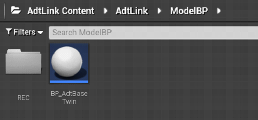
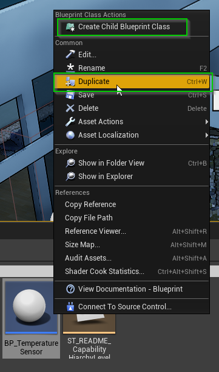
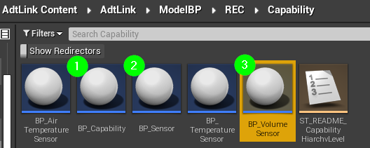
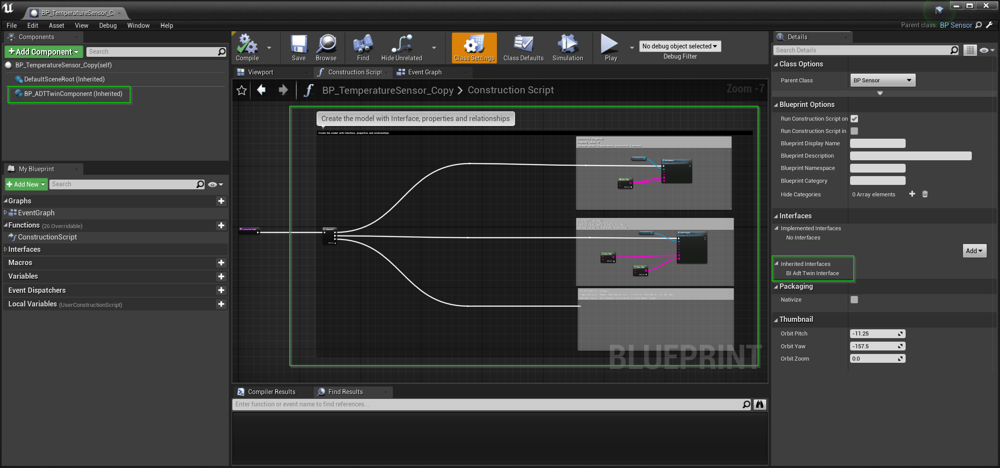
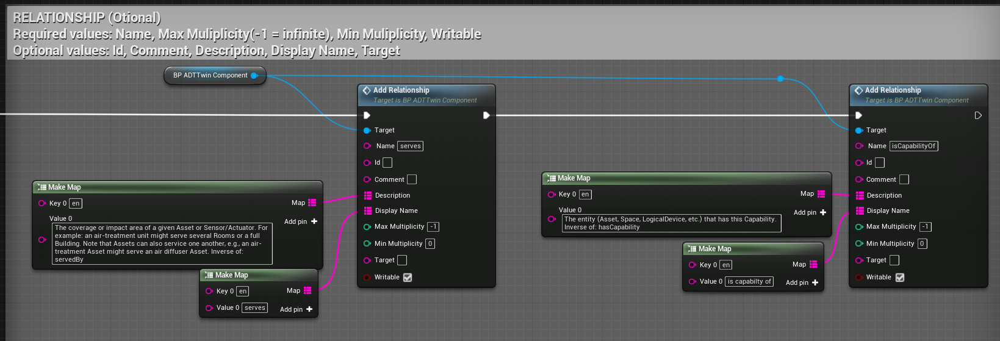
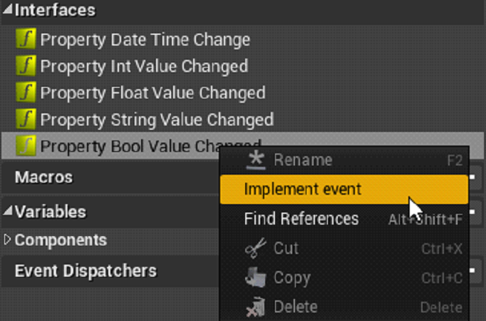
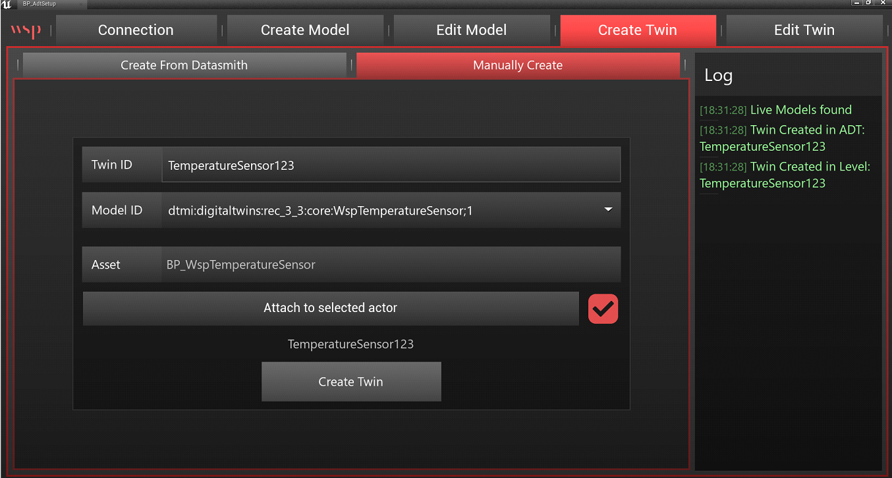

# Creating Custom Models

The sample project provided here uses very specific virtual IOT devices that we simulate with MockDevices. If you are setting up your own Azure Digital Twins ecosystem with your own real devices, sensors, and models, then you'll need to define your models with these steps.

> NOTE: At this time, the ADTLink plugin is unable to import existing models or devices from an ADT instance. To properly mirror any pre-existing models you will need to carefully define them all here and upload them individually via the ADT Link Setup utility. If all the IDs and properties match, you should have a functional digital twin. However, this current implementation does not account for all possible ADT features and should be used primarily as a reference.

## Create the Model Blueprint
As you will remember from the sample project setup, for every model type (Building, Room, Sensor, TemperatureSensor, etc) there is a separate corresponding Blueprint that defines all its properties. 

When creating your own model, it's best to start from an existing Blueprint class as a base. The "BP_AdtBaseTwin" asset in AdtLinkContent\AdtLink\ModelBP is the simplest type, but you can also derive from the Real Estate Core models we developed for the sample scene. In this example, I am duplicating the TemperatureSensor model located at AdtLinkContent\AdtLink\ModelBP\REC\Capability. 





You can also "Create Child Blueprint Class" from the right-click menu if you want to extend an existing class and inherit its properties. In the sample you can see that the VolumeSensor is a child of Sensor, which is a child of Capability.



 If you create a child class in this way you will need to copy and replace the Construction Script with the Construction Script of another class to properly define its new properties. Do not call the inherited construction script of a parent class, as this might create duplicated properties.


## Defining Model Properties

A Model blueprint must have 3 important things:
1) ADT Twin Component
2) ADT Twin Interface
3) Construction script twin data



The construction script is used to set up the model data, including Interface, Properties, and Relationships. This data is what gets converted to JSON/DTDL and synced with ADT in order to create the models in Azure. The Interface data is required, but if your model type does not need Properties or Relationships you can disconnect those pins.

The Interface is where you define the Display name and optional description of the model. The "Id" variable is the DTMI, which should follow the DTDL standards [defined here.](https://github.com/Azure/opendigitaltwins-dtdl/blob/master/DTDL/v2/dtdlv2.md#digital-twin-model-identifier) The ID must consist of ```<scheme> : <path> ; <version>```


The Properties section is important if there is data to save to the twin, such as a new temperature in this case. The required variables are "Name" and "Schema".


Relationships are used to connect twin instances to each other. The name is the only required variable here. "Max Multiplicity" is the upper limit of how many other twins this relationship can handle, and a value of "-1" is infinite. The LightingSensor example needs no relationships, but you can see below that Capability has multiple. Feel free to add or remove as many as you need. 



When an update is sent from ADT, the BP_Communicator in the level will send the data to the right instanced twin using its ADT Twin Interface. To define what happens when the twin receives an update, you must first implement an event from that interface. In the model blueprint, on the left-hand side under Functions there is an Interfaces section that has events for various types of value changes. Right click on one of them and choose "Implement event".



When a value of the corresponding type is updated, this custom event will be fired. You can use this for things like printing debug text, changing colors of a mesh, or spawning a particle effect.


> NOTE: Not all DTDL schemas are supported by Unreal Engine, so we automatically convert them where possible. These are the supported property types and their conversion:

| DTDL     | Unreal                 |
| -------- | ---------------------- |
| Boolean  | Boolean                |
| DateTime | DateTime               |
| Date     | DateTime (ignore Time) |
| Time     | DateTime (ignore Date) |
| Float    | Float                  |
| Double   | Float                  |
| Integer  | Integer                |
| Long     | Integer                |
| String   | String                 |

## Managing Your Custom Models and Twins
Now that you have an updated model, it's ready to be synced with ADT and instantiated into the world. Follow [these steps](./adt-link-plugin-ue.md#uploading-the-models) to set it up and upload to ADT. If the Model ID and Twin ID are not embedded into your 3D model (see: [Preparing CAD Models](./preparing-cad-models.md)) you will select "Manually Create" in the "Create Twin" tab. This will place it straight into your level or optionally attach it to an existing actor.



