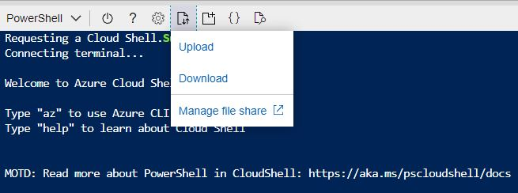

# Deploy Azure Resources

This document walks you throught steps to deploy the backend Azure resources, blah, blah ,blah

TODO:   assume pre-req's are architecture are covered elsewhere

TODO:  explain how we automated as much as possible, blah, blah, blah

## Prepare deployment environment

If this is the first time you've deployed an Azure Digital Twins(ADT)-based solution, we need to register the provider in your subscription. In your cloud shell, run this commmand to register ADT:

```bash
az provider register --namespace 'Microsoft.DigitalTwins'
```

Now we need to grab some files that will be used in the deployment. Run this command to download the necessary deployment files.

TODO:  final URL

``` bash
git clone http://github.com/stevebus/unrealpoc
cd unrealpoc/deployment
```

Create and Azure Resource Group to contain all the Azure resources we will need for this solution. This will keep all the deployed Azure resources together and will allow you to clean them all up when you are done with the demo by simply deleting the resource group.

Next, let's pick a location for deployment.  To view available locations for your subscription, run

``` bash
az account list-locations -o table
```

that will give you a list of locations that looks something like this (cut off for brevity)


Pick your desired region, noting the 'short' name (like 'eastus2') that we will use later.  Also make sure that all of the services used in this demo are available in your chosen region (blue check mark) on [this page](https://azure.microsoft.com/en-us/global-infrastructure/services/?products=functions,signalr-service,digital-twins,event-grid,iot-hub&regions=us-east,us-east-2,us-central,us-north-central,us-south-central,us-west-central,us-west,us-west-2,asia-pacific-east,asia-pacific-southeast,europe-north,europe-west) are available there (ignore "Device Update for IoT Hub", we aren't using it for this demo).  If any of these services are not available, you'll need to pick a different region.

Once you have a region, let's set up some variables that we will use in subsequent commands.  Run the following code, substituting the values as described below

```bash
projectname=<project name>
location=<location>
```

where \<project name> is a short name (5-10 characters and MUST be all lowercase) that describes your project and \<location> is the 'short name" of your chosen location (for example 'eastus2').  We will use the \<project name> as the prefix for the name we use for all of the Azure resources we will create.  

Create a resource group in that region with this command:

```bash
rgname=${projectname}-rg

az group create -n $rgname --location $location
```

## Prepare security credentials

Azure Digital Twins (ADT) is secured by Azure Active Directory (AAD). For both you, and the Unreal application, we need to gather (yours) and create (Unreal's) credentials in AAD.

First, we need to look up the object id entry in Azure Active Directory for your user name.  To do so, run this command:

``` bash
myuserid=$(az ad signed-in-user show --query objectId -o tsv) && echo $myuserid
```

You should see a GUID printed out on the screen

Next, we will create an "application registration" in AAD. This will serve as the credentials the Unreal application uses to connect to ADT. We start by creating an AAD service principal

Start the process with the following commands

```bash
appregname='http://'${projectname}-appreg

appreg=$(az ad sp create-for-rbac --name ${appregname} --skip-assignment) && echo $appreg | jq
```

Copy the output of this command to your notepad or elsewhere to keep up with it.  __WARNING:  the 'password' shown in this output CANNOT be retrieved again after this, so keep it in a safe place and keep up with it. You'll need it to connect the Unreal engine to the Azure environment. If you lose it, you'll need to create new credentials.__

Next run these commands to finish setup of the credentials

```bash
appid=$(echo $appreg | jq -r .appId)

appregobjectid=$(az ad sp show --id $appregname --query objectId -o tsv) && echo $appregobjectid

az ad app permission add --id $appid --api 0b07f429-9f4b-4714-9392-cc5e8e80c8b0 --api-permissions 4589bd03-58cb-4e6c-b17f-b580e39652f8=Scope

az ad app permission grant --id $appid --api 0b07f429-9f4b-4714-9392-cc5e8e80c8b0
```

## Deploy Resources

We are now ready to deploy the Azure Resources. This is accomplished by running what's called an Azure Resource Manager (ARM) deployment written in a script language called Bicep.

To execute the Bicep file and begin the deployment, run the following command

```bash
az deployment group create -g $rgname -f ./azuredeploy.bicep --parameters projectName=$projectname userId=$myuserid appRegId=$appregobjectid
```

The deployment will take several minutes.  Once it is done, you should see a screen full of JSON scroll by.

To confirm a successful deployment, run the following command

```bash
az deployment group show -n azuredeploy -g $rgname --query {state:properties.provisioningState}
```

You should see the status:

```json
{
    "state":"succeeded"
}
```

## Gather important inputs

For subsequent steps in the project, you need to know the final name of several of the azure resources created.  To gather these values, run this command:

```bash
az deployment group show -n azuredeploy -g $rgname --query properties.outputs.importantInfo.value
```

Note the values returned from this command. Save them somewhere like notepad for use later.

In particular make note of the "iothubName" as you will need it for the next step

## Create IoT devices and prep simulator

Later in this tutorial, you will use a device simulator to drive simulated data through the IoT and digital twins platforms to the Unreal engine. Before we can do that, we need to create the simulated devices in our IoT Hub

To start the process, change directories to the /unrealpoc/devices folder and set the mock-devices-config.sh script to be executable

```bash
cd /unrealpoc/devices
chmod 777 ./mock-devices-config.sh
```

from the devices folder, run this command to create your devices and apply them to the pre-supplied template

``` bash
./mock-devices-config.sh ./mock-devices-template.json <iot hub name>
```

where \<iot hub name> is the name of your IoT Hub created above.  You'll see the devices being created.  Note, you will likely see a number of ERROR messages that say "ErrorCode: DeviceNotFound".  This is normal and expected, as we first check to see if the device is already created and, if we get the error, then we create them.  Ignore this error.

Once the script completes, the mock-devices-template.json file contains the simulation configuration we will need later. We need to download this file to your desktop.

To do so, in the cloud shell, click on the icon shown below and choose "Download".



In the download box, enter '/unrealpoc/devices/mock-devices-template.json' and click "Download"

Depending on your browser, your file will be downloaded somewhere to your machine.  Note the location as we'll need it later.
