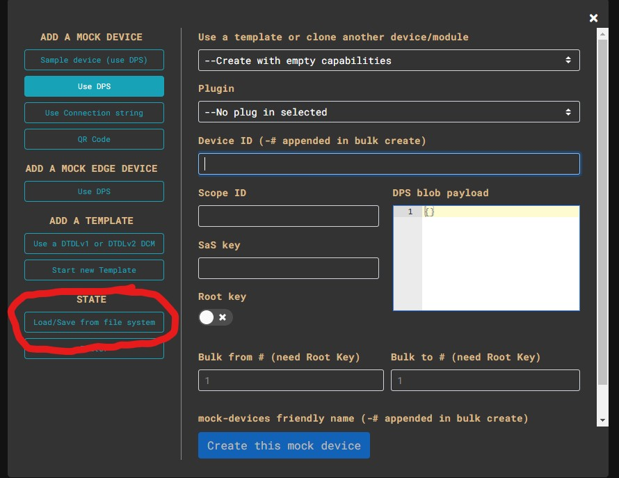
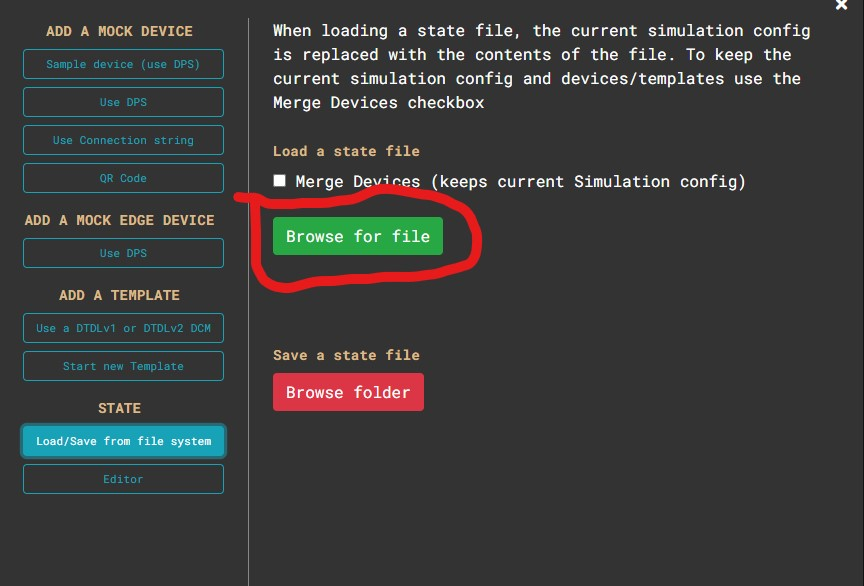

# Simulate the IoT Devices

For this demo, we will be simulating the IoT devices shown in the building model in the Unreal engine. The devices represent five instances of four different types of devices at various locations in the building:

* HVAC sensor - simulating temperature and associated airflow in the outputs of an HVAC system
* Temp sensor - simulating temperature readings at various points
* Lighting - simulating lighting control sensors, toggling lights off and on
* Presence - simulating presence sensors which detect the presence of people in an area

## Pull Down Mock-Devices

For the demo, we use the [mock-devices](https://github.com/codetunez/mock-devices) tool to simulate the IoT sensors.  To install the tool, open a command prompt on your desktop, change to a folder where you have write priviledges (under your "Documents" folder is a good candidate), and run this command to pull down the mock-services repo:

```cmd
git clone http://github.com/codetunez/mock-devices
```

> NOTE:  Alternately, if you don't have git installed, on the home page of the mock-devices github repo, you can download a 'zip' of the solution by clicking on the "Code" button above the list of files and choosing "Download Zip". If you download it, unzip it to the folder you chose above

Separately clone or download the [Unreal Demo](http://github.com/stevebus/unrealdemo) repo as well, if you haven't already.

## Add Plugins and Build Mock-Devices

For the POC, we wrote a couple of plug-ins to add some pseudo-realism to the data created by the simulators. To deploy the plug-ins, follow these steps

* in the 'unrealpoc' demo folder you downloaded from github, copy the following files from the \plugins folder
  * hvac.ts
  * smartbinary.ts
  * index.ts
* in the mock-devices repo folder, under the src\server\plugins folder, paste the files (overwriting index.ts)

From the root of the mock-devices folder, run these commands

```node
cd mock-devices
npm ci && npm run build
```

After the application is built, you are ready to run it.  Type:

```node
npm run app
```

After a few moments, the mock-devices UI will open.  On the left-hand nav, hit the "Add/Save" button.


On the dialog, click the "Load/Save from Filesystem" button



on the next screen, click "Browse for file"



Select the 'mock-devices-template.json' file you saved during the deployment step and click "open"

You'll see a list of devices, four 'template' and five devices of each of the types listed at the top of this page.  Click on the "Dashboard" button the left nav and you'll see icons representing each of the devices


>NOTE:  there is an intermittent bug in the mock-devices GUI that makes the devices not show up in the "power" tab of the dashboard. If this happens, just return to the "Devices" button the left nav

On the left nav, click on "PWR ALL".  This will power all of the devices.  You'll first see 'delay' in the dashboard, as mock-devices adds a random delay so that all the devices don't start all at once. Eventually all of the devices will on and you'll see them start sending data to your IoT Hub.  You can see the data being sent in the mock-devices log at the top of the screen.

You will see temperature data first, then likely airflow.  Those are sent randomly between 30-60 seconds by default.  Lighting and Occupancy is sent less frequently, so it should be a few more minute before they are sent.

You are now ready to return to the Unreal app and see the data changing live in your 3D environment when you play the game.
